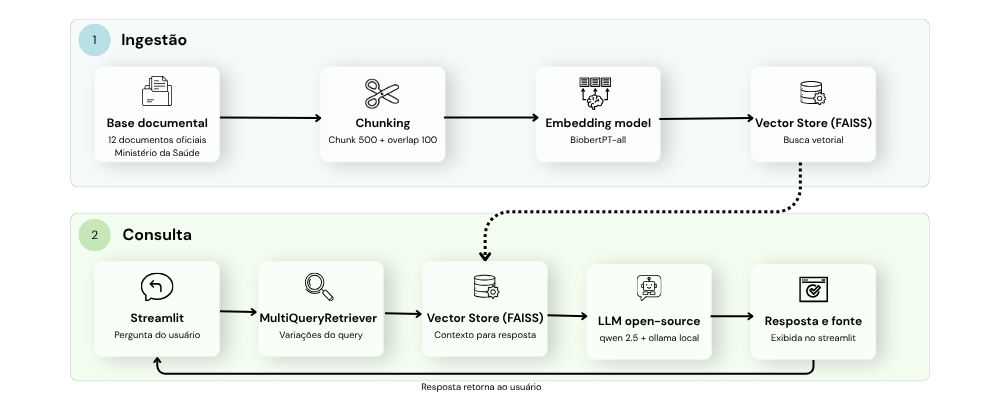

# 🩺 MedSimpli

### *Saúde em linguagem simples — RAG aplicado à compreensão de termos médicos em português brasileiro*

---

## 📌 Visão Geral

O **MedSimpli** é um protótipo acadêmico que transforma perguntas sobre saúde em respostas claras, acessíveis e baseadas em documentos recuperados da base do sistema.

A solução utiliza a abordagem **RAG (Retrieval-Augmented Generation)**, combinando:

- **recuperação semântica** de trechos relevantes da base documental;
- **geração com LLM** para produzir uma resposta em linguagem simples;
- **exibição das fontes recuperadas**, promovendo mais transparência e rastreabilidade.

O objetivo é apoiar a compreensão de termos médicos, sintomas, doenças, exames e orientações de saúde em **português brasileiro**, com foco em acessibilidade e letramento em saúde.

---

## 🎯 Objetivo

> **Transformar informações médicas complexas em linguagem acessível, sem perder o sentido original da informação.**

O MedSimpli busca reduzir barreiras cognitivas, apoiar a autonomia do usuário e oferecer uma experiência mais compreensível na leitura de conteúdos de saúde.

---

## 🚀 Funcionalidades

- **Perguntas em linguagem natural**
- **Busca semântica** sobre a base documental
- **Respostas geradas por LLM** em linguagem simples
- **Exibição dos documentos recuperados**
- **Regras de segurança**, evitando diagnóstico, prescrição e invenção de informação
- **Interface web em Streamlit** com foco em demonstração de uso

---

## 🧱 Arquitetura Atual

O projeto está organizado em quatro partes principais:

### `rag_prep.py`
Responsável por:
- carregar os documentos da base (`data/cleaned`);
- quebrar os textos em chunks;
- gerar embeddings;
- criar ou carregar o índice vetorial **FAISS**.

### `rag_response.py`
Responsável por:
- carregar o modelo via **Ollama**;
- carregar embeddings e índice vetorial;
- executar a recuperação semântica;
- montar o pipeline RAG;
- retornar a resposta gerada e os documentos recuperados.

### `rag_test.py`
Camada intermediária usada para:
- testar o pipeline localmente;
- servir como ponte entre a interface e o pipeline RAG.

### `app_streamlit.py`
Interface principal do sistema:
- recebe a pergunta do usuário;
- envia os parâmetros para o pipeline;
- exibe a resposta gerada;
- exibe os documentos recuperados.

---

## 🤖 Arquitetura RAG


---

## 🧠 Prompt Base

```text
Você é um assistente do MedSimpli, um sistema de apoio à compreensão
de linguagem médica em português brasileiro.

O objetivo do MedSimpli é ajudar usuários a entender termos médicos,
doenças, sintomas, exames e orientações de saúde por meio de
explicações simples, claras e acessíveis, sempre com base em fontes
confiáveis recuperadas pelo sistema.

Contexto recuperado:
{context}

Pergunta do usuário: {question}

Sua tarefa é responder à pergunta usando apenas o contexto fornecido.

Siga estas regras:
- use apenas as informações presentes no contexto recuperado;
- não invente informações e não complemente com suposições;
- se o contexto não contiver informação suficiente, responda exatamente:
  "Não encontrei informações suficientes sobre esse tema na base do
  MedSimpli. Consulte um profissional de saúde.";
- escreva em português brasileiro claro e objetivo;
- evite jargões desnecessários;
- quando existir um termo popular equivalente ao termo técnico,
  mencione-o entre parênteses;
- quando útil, organize a resposta em tópicos curtos;
- não forneça diagnóstico;
- não prescreva tratamento;
- não substitua a avaliação de um profissional de saúde.
```

---

## 🛠️ Tecnologias Utilizadas

- **Python 3.10+**
- **Streamlit**
- **LangChain**
- **FAISS**
- **Hugging Face Embeddings**
- **Ollama**
- **Qwen 2.5**
- **JSON** como base documental inicial

---

## 📂 Estrutura do Projeto

```text
.
├── app_streamlit.py
├── rag_prep.py
├── rag_response.py
├── rag_test.py
├── data/
│   └── cleaned/
├── faiss_vectorstore/
├── document_retrieval_test/
├── requirements.txt
└── README.md
```

---

## ▶️ Como Executar Localmente

### 1) Criar e ativar o ambiente virtual

```bash
python -m venv venv
```

**Windows**
```bash
venv\Scripts\activate
```

**Linux/macOS**
```bash
source venv/bin/activate
```

---

### 2) Instalar as dependências

```bash
pip install -r requirements.txt
```

---

### 3) Garantir que o Ollama está instalado

Teste no terminal:

```bash
ollama --version
```

---

### 4) Gerar ou carregar o índice vetorial

```bash
python rag_prep.py
```

Esse passo:
- lê os documentos em `data/cleaned`;
- gera embeddings;
- cria ou carrega o índice `faiss_vectorstore`.

---

### 5) Testar o pipeline RAG localmente

```bash
python rag_test.py
```

---

### 6) Rodar o modelo no Ollama

Exemplo com um modelo para testes:

```bash
ollama run qwen2.5:14b
```

---

### 7) Executar a interface

```bash
streamlit run app_streamlit.py
```

---

## ⚠️ Observações Importantes

- O projeto está configurado atualmente para **uso local**.
- O app atual **não depende mais do backend FastAPI antigo** para funcionar.
- A qualidade da resposta depende de:
  - qualidade da recuperação semântica;
  - qualidade da base documental;
  - modelo escolhido no Ollama.

---

## 📉 Limitações Atuais

- A base documental ainda é limitada em cobertura.
- O sistema é um **protótipo acadêmico**, não um produto clínico validado.

---

## 📒 Avaliação e apresentação:

- Link da planilha de avaliação: https://docs.google.com/spreadsheets/d/1WvPBUsMf4o2nyYfV4cZjtiGDyvoLSWquX00btC6P-As/edit?gid=674191125#gid=674191125
- Link da apresentação: https://www.canva.com/design/DAG4Ny1ttxE/I5Law8-SntsOYFDkEcgVjw/edit
---

## 🛡️ Aviso

O MedSimpli **não substitui avaliação médica profissional**.

As respostas têm caráter educativo e informacional.  
Em caso de dúvidas, sintomas ou decisões sobre tratamento, procure um profissional de saúde.

---

## 💙 Autoria

Desenvolvido por **Ana Beatriz Maciel Nunes** e **Marcelo Heitor de Almeida Lira**.

Protótipo acadêmico desenvolvido na disciplina **Oficina II**, com foco em **RAG, NLP e acessibilidade da informação em saúde**.
