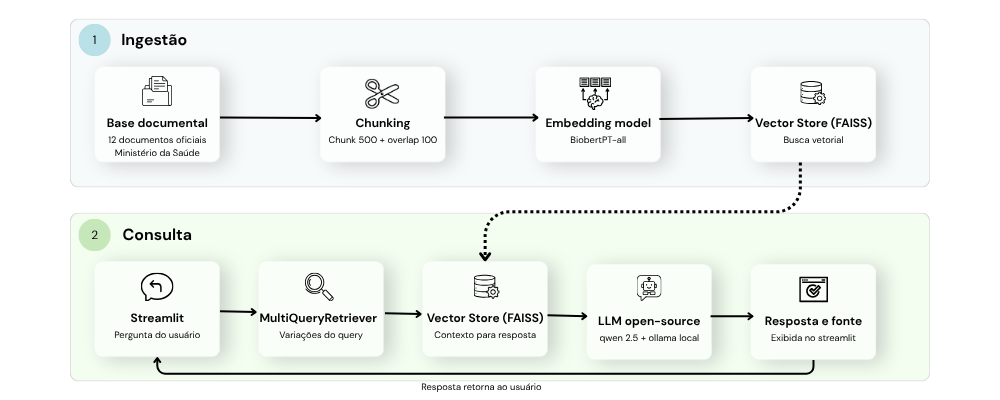

# 🩺 MedSimpli

### *Saúde em linguagem simples — RAG e Agentic RAG aplicados à compreensão de informações médicas em português brasileiro*

---

## 📌 Visão Geral

O **MedSimpli** é um protótipo acadêmico que transforma perguntas sobre saúde em respostas mais claras, acessíveis e baseadas em documentos recuperados da base do sistema.

A solução utiliza a abordagem **RAG (Retrieval-Augmented Generation)** e uma evolução com **Agentic RAG**, combinando:

- recuperação semântica de trechos relevantes da base documental;
- geração de respostas em linguagem simples;
- exibição das fontes recuperadas;
- classificação de intenção da pergunta;
- validação do contexto recuperado;
- fallback para perguntas sensíveis ou fora do domínio;
- avaliação experimental com RAGAS.

O objetivo é apoiar a compreensão de termos médicos, doenças, sintomas, exames e orientações de saúde em **português brasileiro**, com foco em acessibilidade, rastreabilidade e letramento em saúde.

---

## 🎯 Objetivo

> **Transformar informações médicas complexas em linguagem acessível, sem perder o sentido original da informação.**

O MedSimpli busca reduzir barreiras cognitivas, apoiar a autonomia do usuário e oferecer uma experiência mais compreensível na leitura de conteúdos de saúde.

---

## 🚀 Funcionalidades

- Perguntas em linguagem natural
- Busca semântica sobre documentos de saúde
- Respostas geradas por LLM em linguagem simples
- Exibição dos documentos recuperados
- Conversão de PDFs oficiais para JSON
- Criação e carregamento de índice vetorial FAISS
- Teste de recuperação sem LLM
- Teste de resposta completa com LLM via Ollama
- Camada Agentic RAG com:
  - classificação de intenção;
  - reescrita de consulta;
  - recuperação de contexto;
  - validação de contexto;
  - extração de termos;
  - geração de resposta simples;
  - fallback para perguntas sensíveis;
  - fallback para perguntas fora do domínio.
- Interface web em Streamlit
- Script de avaliação experimental com RAGAS

---

## 🧱 Arquitetura Atual

O projeto está organizado em seis partes principais.

### `pdf_to_json.py`

Responsável por:

- ler PDFs em `data/raw`;
- extrair texto página por página;
- gerar arquivos JSON em `data/cleaned`;
- preservar metadados como título, ano, tipo de documento, arquivo de origem e páginas.

### `rag_prep.py`

Responsável por:

- carregar documentos processados em `data/cleaned`;
- limpar páginas editoriais ou pouco úteis para recuperação;
- quebrar textos em chunks;
- gerar embeddings;
- criar ou carregar o índice vetorial **FAISS**;
- executar recuperação de documentos;
- aplicar ajustes de recuperação, como reranking por termos da pergunta.

### `rag_response.py`

Responsável pelo pipeline RAG clássico:

- carregar o modelo via **Ollama**;
- carregar embeddings e índice FAISS;
- recuperar documentos relevantes;
- montar o prompt com contexto;
- gerar resposta com LLM;
- retornar resposta e documentos utilizados.

### `rag_test.py`

Camada de teste local do RAG:

- cria o índice FAISS se ele ainda não existir;
- usa o índice existente quando disponível;
- permite testar apenas recuperação;
- permite testar resposta completa com LLM;
- só recria o índice quando solicitado explicitamente com `--force-rebuild`.

### `agentic/`

Contém a camada **Agentic RAG**, incluindo:

- `agent.py`: orquestra o fluxo do agente;
- `skills.py`: implementa as skills do agente;
- `prompts.py`: concentra prompts auxiliares;
- `mock_contexts.json`: contextos simulados para testes controlados;
- `test_agent.py`: teste do agente com mock;
- `test_agent_faiss.py`: teste do agente integrado ao FAISS;
- `SKILL.md`: documentação das skills.

### `app_streamlit.py`

Interface principal do sistema:

- recebe a pergunta do usuário;
- envia a pergunta para o pipeline;
- exibe a resposta gerada;
- exibe os documentos recuperados.

### `ragas_eval.py`

Script de avaliação experimental:

- compara o RAG clássico com o Agentic RAG;
- utiliza perguntas de referência;
- executa avaliação com RAGAS;
- salva resultados em `ragas_outputs/`.

> Observação: a execução completa do RAGAS pode exigir mais memória RAM e configuração de avaliador externo, como uma chave de API, dependendo da versão e das métricas utilizadas.

---

## 🤖 Arquitetura RAG



---

## 🧠 Prompt Base

```text
Você é um assistente do MedSimpli, um sistema de apoio à compreensão
de linguagem médica em português brasileiro.

O objetivo do MedSimpli é ajudar usuários a entender termos médicos,
doenças, sintomas, exames e orientações de saúde por meio de
explicações simples, claras e acessíveis, sempre com base em fontes
confiáveis recuperadas pelo sistema.

Contexto recuperado:
{context}

Pergunta do usuário:
{question}

Sua tarefa é responder à pergunta usando apenas o contexto fornecido.

Siga estas regras:
- use apenas as informações presentes no contexto recuperado;
- não invente informações e não complemente com suposições;
- se o contexto não contiver informação suficiente, responda exatamente:
  "Não encontrei informações suficientes sobre esse tema na base do
  MedSimpli. Consulte um profissional de saúde.";
- escreva em português brasileiro claro e objetivo;
- evite jargões desnecessários;
- quando existir um termo popular equivalente ao termo técnico,
  mencione-o entre parênteses;
- quando útil, organize a resposta em tópicos curtos;
- não forneça diagnóstico;
- não prescreva tratamento;
- não substitua a avaliação de um profissional de saúde.
```

---

## 🛠️ Tecnologias Utilizadas

- **Python 3.10+**
- **Streamlit**
- **LangChain**
- **FAISS**
- **Hugging Face Embeddings**
- **Sentence Transformers**
- **Ollama**
- **Qwen 2.5**
- **pypdf**
- **JSON**
- **RAGAS**
- **Pandas**

---

## 📂 Estrutura do Projeto

```text
.
├── agentic/
│   ├── __init__.py
│   ├── agent.py
│   ├── skills.py
│   ├── prompts.py
│   ├── mock_contexts.json
│   ├── SKILL.md
│   ├── test_agent.py
│   └── test_agent_faiss.py
│
├── data/
│   ├── raw/
│   └── cleaned/
│
├── docs/
│   └── architecture.png
│
├── legacy/
│
├── app_streamlit.py
├── data_cleaning.py
├── pdf_to_json.py
├── rag_prep.py
├── rag_response.py
├── rag_test.py
├── ragas_eval.py
├── requirements.txt
├── README.md
└── render.yaml
```

Pastas geradas localmente e normalmente não versionadas:

```text
faiss_vectorstore/
ragas_outputs/
venv/
__pycache__/
```

---

## 📚 Base Documental

A base documental do MedSimpli é composta por documentos oficiais em PDF, previamente convertidos para JSON antes da criação do índice vetorial FAISS.

Os PDFs originais devem ser armazenados em:

```text
data/raw/
```

Após a extração de texto, os arquivos processados são gerados em:

```text
data/cleaned/
```

Cada JSON contém:

- título do documento;
- ano de publicação;
- tipo do documento;
- arquivo de origem;
- texto completo;
- páginas extraídas individualmente.

Essa estrutura foi adotada para permitir maior rastreabilidade entre a resposta gerada e o documento original, facilitando a identificação da fonte e da página de onde o contexto foi recuperado.

### Critérios de seleção da base

A base atual foi reorganizada para priorizar documentos que fossem:

- oficiais ou institucionais;
- escritos em português brasileiro;
- relacionados diretamente a doenças e agravos de saúde;
- explicativos o suficiente para apoiar respostas em linguagem simples;
- menores e mais controláveis computacionalmente;
- menos propensos a gerar excesso de chunks ou ruído na recuperação.

Páginas isoladas sobre doenças específicas, como conteúdos no formato “Saúde de A a Z”, podem repetir muitos termos genéricos, como “sintomas”, “tratamento” e “diagnóstico”, aumentando o risco de recuperação de trechos irrelevantes. Isso era um problema durante os testes do RAG, principalmente com o documento de Lúpus.

Por isso, a base foi ajustada para utilizar documentos mais gerais, porém ainda focados em doenças, buscando equilibrar:

```text
cobertura temática
+ qualidade da fonte
+ custo computacional
+ relevância para recuperação
```

### Documentos utilizados

A base atual contempla três eixos principais de saúde:

1. **Hepatites virais**  
   Documento voltado à explicação das hepatites A, B, C, D e E, com informações sobre transmissão, sintomas, prevenção, testagem e acompanhamento.

2. **Doenças negligenciadas**  
   Documento com cobertura de diferentes doenças e agravos negligenciados, como hanseníase, esquistossomose, malária, tuberculose, raiva, tracoma, leishmaniose e outras condições relevantes para saúde pública.

3. **Arboviroses urbanas**  
   Documento voltado a dengue, Zika e chikungunya, incluindo informações clínicas, sinais e sintomas, diagnóstico diferencial e orientações de cuidado na atenção primária.

Essa composição foi escolhida para ampliar a variedade temática da base sem recorrer a documentos excessivamente grandes ou a páginas isoladas muito repetitivas.

### Processamento dos documentos

O fluxo de preparação da base segue as etapas:

```text
PDFs em data/raw/
→ extração de texto por página
→ geração de JSON em data/cleaned/
→ limpeza de páginas editoriais ou pouco úteis
→ divisão em chunks
→ geração de embeddings
→ criação do índice FAISS
```

Durante a preparação, o sistema pode ignorar páginas com baixo valor para recuperação, como:

- capas;
- sumários;
- fichas catalográficas;
- referências bibliográficas;
- páginas finais de pesquisa de satisfação;
- trechos predominantemente editoriais.

Essa limpeza é importante porque tais páginas podem conter palavras relevantes, mas não oferecem explicações úteis para responder às perguntas do usuário.

### Limitações da base

Apesar da curadoria, a base ainda apresenta limitações:

- a cobertura de doenças ainda é parcial;
- algumas perguntas podem recuperar trechos pouco específicos;
- documentos em PDF podem gerar extrações com quebras de linha ou ruídos;
- perguntas muito curtas, como “O que é dengue?”, podem exigir estratégias adicionais de recuperação;
- a recuperação semântica pode precisar de reranking, filtros por doença ou busca híbrida.

Assim, a base atual deve ser entendida como uma base experimental e controlada, adequada para testes acadêmicos de RAG e Agentic RAG, mas ainda não como uma base clínica completa.

---

## ▶️ Como Executar Localmente

### 1) Criar e ativar o ambiente virtual

```bash
python -m venv venv
```

**Windows**

```bash
venv\Scripts\activate
```

**Linux/macOS**

```bash
source venv/bin/activate
```

---

### 2) Instalar as dependências

```bash
pip install -r requirements.txt
```

---

### 3) Garantir que o Ollama está instalado

Teste no terminal:

```bash
ollama --version
```

Baixe o modelo usado nos testes:

```bash
ollama pull qwen2.5:3b
```

ou:

```bash
ollama pull qwen2.5:7b
```

---

### 4) Converter PDFs para JSON

Coloque os PDFs em:

```text
data/raw/
```

Depois execute:

```bash
python pdf_to_json.py
```

Esse passo gera os arquivos processados em:

```text
data/cleaned/
```

---

### 5) Criar ou carregar o índice FAISS

```bash
python rag_test.py --build
```

Esse comando cria o índice FAISS se ele ainda não existir.  
Se o índice já existir, ele será carregado e não será recriado.

Para forçar recriação do índice:

```bash
python rag_test.py --force-rebuild
```

---

### 6) Testar apenas a recuperação

```bash
python rag_test.py --retrieval --query "O que são hepatites virais?"
```

Exemplo com outra pergunta:

```bash
python rag_test.py --retrieval --query "O que é dengue?"
```

---

### 7) Testar o RAG clássico com LLM

```bash
python rag_test.py --response --model qwen2.5:3b --query "O que são hepatites virais?"
```

---

### 8) Testar o Agentic RAG com FAISS

```bash
python -m agentic.test_agent_faiss
```

Esse teste verifica o fluxo:

```text
classificação de intenção
→ escolha da consulta
→ recuperação FAISS
→ validação de contexto
→ resposta ou fallback
```

---

### 9) Executar a interface

```bash
streamlit run app_streamlit.py
```

---

## 🧪 Avaliação com RAGAS

O arquivo `ragas_eval.py` contém uma avaliação experimental para comparar:

```text
classic_rag
agentic_rag
```

Para rodar:

```bash
python ragas_eval.py
```

Os resultados são salvos em:

```text
ragas_outputs/
```

A avaliação completa pode exigir:

- mais memória RAM;
- modelo local carregado via Ollama;
- configuração de avaliador externo, dependendo das métricas do RAGAS;
- ajuste de versão do RAGAS.

Em caso de conflito de versão, pode ser útil instalar uma versão estável:

```bash
pip install ragas==0.1.21 datasets pandas langchain-openai
```

Se for utilizar avaliador externo via OpenAI no PowerShell:

```bash
$env:OPENAI_API_KEY="sua-chave"
```

---

## ⚠️ Observações Importantes

- O projeto está configurado atualmente para uso local.
- O app atual não depende mais do backend FastAPI antigo para funcionar.
- A qualidade da resposta depende de:
  - qualidade da base documental;
  - qualidade da recuperação semântica;
  - qualidade dos chunks;
  - modelo escolhido no Ollama;
  - configuração do `top_k`.
- A camada Agentic RAG não substitui a recuperação, mas adiciona controle de fluxo, validação e fallback.

---

## 📉 Limitações Atuais

- A base documental ainda é limitada em cobertura.
- A recuperação semântica ainda pode retornar trechos pouco relevantes para algumas perguntas.
- Perguntas curtas podem exigir busca híbrida, reranking ou filtros adicionais por doença.
- A execução local pode ser limitada por memória RAM.
- O sistema é um protótipo acadêmico, não um produto clínico validado.

---

## 📒 Avaliação e Apresentação

- Link da planilha de avaliação: https://docs.google.com/spreadsheets/d/1WvPBUsMf4o2nyYfV4cZjtiGDyvoLSWquX00btC6P-As/edit?gid=674191125#gid=674191125
- Link da apresentação: https://www.canva.com/design/DAG4Ny1ttxE/I5Law8-SntsOYFDkEcgVjw/edit

---

## 🛡️ Aviso

O MedSimpli **não substitui avaliação médica profissional**.

As respostas têm caráter educativo e informacional.  
Em caso de dúvidas, sintomas ou decisões sobre tratamento, procure um profissional de saúde.

---

## 💙 Autoria

Desenvolvido por **Ana Beatriz Maciel Nunes** e **Marcelo Heitor de Almeida Lira**.

Protótipo acadêmico desenvolvido na disciplina **Oficina II**, com foco em **RAG, Agentic RAG, NLP e acessibilidade da informação em saúde**.
